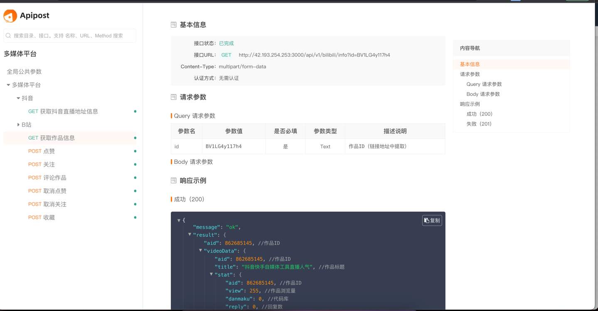

# 哔哩哔哩网页协议 👋

## 版本更新记录📝
| 版本   | 更新内容                                                                              | 更新时间       |
|------|-----------------------------------------------------------------------------------|------------|
| v1.3 | 重构Go快手&抖音服务端（增加代理IP传参,废弃PHP版本服务端，补全接入文档说明，增加`哔哩哔哩｜Bilibili`API接口【点赞、评论、分享、收藏、投币】） | 2023.02.15 |

## [抖音请移步👉](https://github.com/YunzhiYike/douyin-live)
## [快手请移步👉](https://github.com/YunzhiYike/kuaishou-live)

## 免费开放服务测试地址
> http://42.193.254.253:3000

## [API文档说明 ｜猛戳我👈👈](https://console-docs.apipost.cn/preview/bdf25a21bc341bab/3dfc2f784646d7f7)
